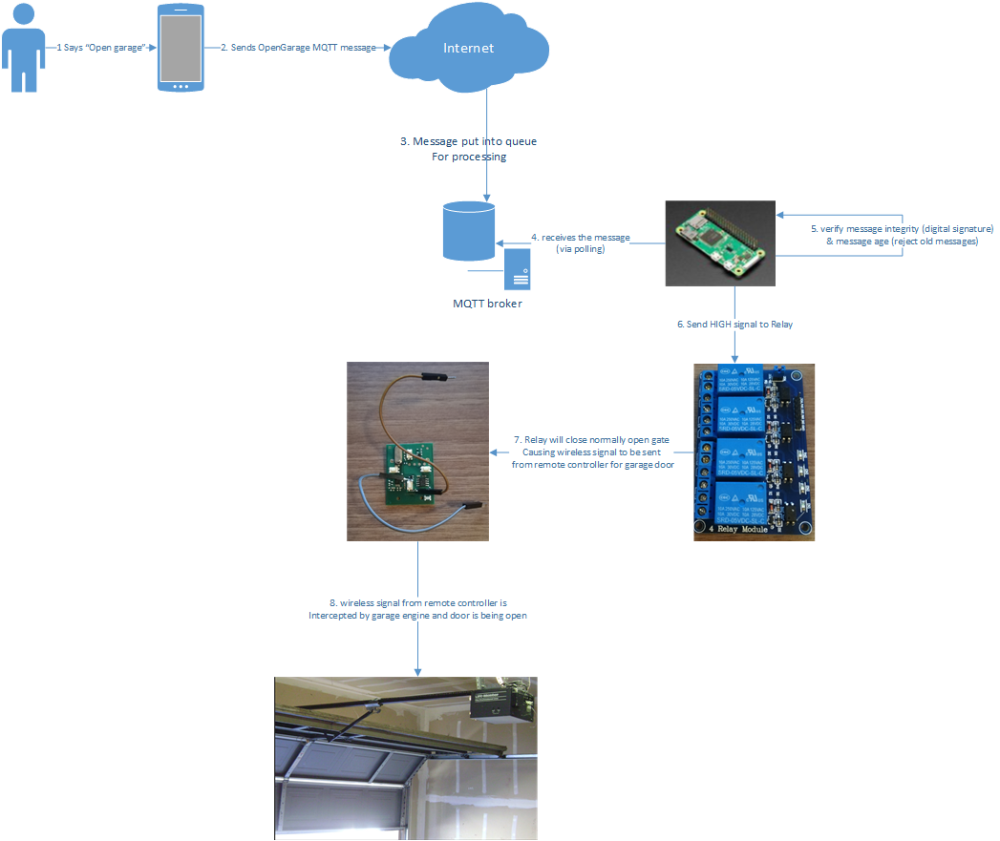
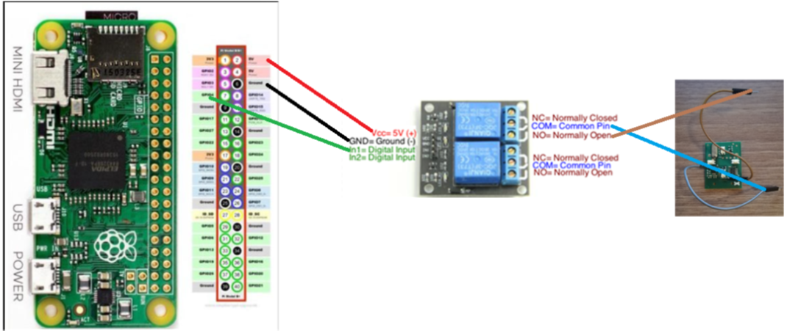

# Garage Controller

---
[](https://www.rust-lang.org/)
[](../../graphs/commit-activity)
[](LICENSE-APACHE)
[](LICENSE-MIT)
[](https://travis-ci.org/jabber-tools/garage-controller)

Microcontroller software for Raspberry Pi. Based on commands received from MQTT opens/closes garage door utilizing wireless garage door controller connected to GPIO.

[High Level Setup](#high-level-setup)

[GPIO PIN Setup](#gpio-pin-setup)

[Cross-compilation on ARMv6 and ARMv7 architectures](#cross-compilation-on-armv6-and-armv7-architectures)

[Compiling RPPAL library](#compiling-rppal-library)

## High Level Setup
</br>

1.	User says open garage door
2.	Virtual assistant translates the voice to text (via natural language understanding) and then performs natural language processing in order to understand user’s intent. Intent is understood (user wants to open garage door)
3.	Appropriate fulfillment function (running as HTTP webservice deployed on internet) is called by virtual assistant (i.e. function handleIntentOpenGarage). This function will
    a.	Prepare payload for OpenGarage message
    b.	Digitally sign it to ensure message integrity. For this JWT (JSON Web tokens, see https://jwt.io/) technology is used
    c.	Publishes/puts the message into appropriate queue in MQTT provider. Connection to MQTT provider is secure, i.e. apart from message security also transport layer is secured. MQTT provider is further secured with username/password credentials, i.e. only authorized user can publish to MQTT queue
4.	Microcontroller is running MQTT client library and subscribing to MQTT queue. Once it receives the message from MQTT queue appropriate processing will happen:
5.	Message is decrypted and verified (both age of the message and digital signature). 
    a. Invalid messages are rejected and not processed further.
    b.	Valid messages are processed. HIGH signal is send for 400 ms into relay input pin
6.	Normally open gate of the relay is closed for 400 ms causing electrical circuit to get closed and electricity to flow in remote garage door controller into soldered pin (from internal battery). This has basically same effect as if user pressed button on remote controller. 
7.	Wireless signal is sent to garage door engine and door is open


## GPIO PIN Setup
TBD</br>
</br>

## Cross-compilation on ARMv6 and ARMv7 architectures
See [https://github.com/japaric/rust-cross](https://github.com/japaric/rust-cross)
```
sudo apt-get update
# Install the C cross toolchain
sudo apt-get install -qq gcc-arm-linux-gnueabihf

#Install the cross compiled standard crates
rustup target add armv7-unknown-linux-gnueabihf  #for ARMv7 
rustup target add arm-unknown-linux-gnueabihf #for ARMv6 (Pi Zero)

mkdir -p ~/.cargo
touch ~/.cargo/config

#put following content into file:
[target.armv7-unknown-linux-gnueabihf]
linker = "arm-linux-gnueabihf-gcc"

[target.arm-unknown-linux-gnueabihf]
linker = "arm-linux-gnueabihf-gcc"

#ARMv7 build
cargo build --target=armv7-unknown-linux-gnueabihf

#ARMv6 build
cargo build --target=arm-unknown-linux-gnueabihf
```
Nice details on compilation for Raspberry Pi Zero (ARMv6) can be found [here](https://disconnected.systems/blog/rust-powered-rover/#setting-up-rust-for-cross-compiling).

## Compiling RPPAL library
In order to compile following dependency [RPPAL](https://github.com/golemparts/rppal) CC compiler must be installed otherwise following error will be thrown:
error: linker `cc` not found
could not compile `libc`.

Details [here](https://ostechnix.com/how-to-fix-rust-error-linker-cc-not-found-on-linux/)

Solution is to run following command:
```
sudo apt install build-essential
```
Nice article on rust cross-compilation to arm architecture can be also found here [here](https://www.growse.com/2020/04/26/adventures-in-rust-and-cross-compilation-for-the-raspberry-pi.html).

